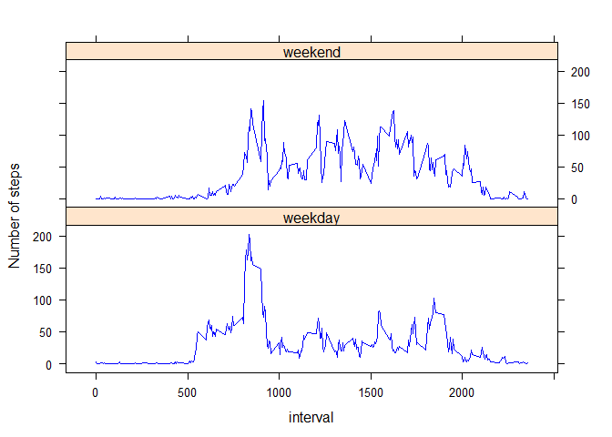

#Repdata-003 : Peer Assesment 1
##Loading and preprocessing the data
###Alan Walters
###Friday, January 09, 2015


##Load the data into R & Preprocess 
(1) The data is read from the csv file.

```r
        activityData <- read.csv(file="activity.csv");
```
and display the top reord set

```r
        head(activityData);
```

```
##   steps       date interval
## 1    NA 2012-10-01        0
## 2    NA 2012-10-01        5
## 3    NA 2012-10-01       10
## 4    NA 2012-10-01       15
## 5    NA 2012-10-01       20
## 6    NA 2012-10-01       25
```


(2) We need to complete some conversion on this data.

- convert the date 

```r
        activityData$date <- as.Date(activityData$date)
        class(activityData$date)
```

```
## [1] "Date"
```
- Dates with and without NA's

```r
        dataFiltered <- activityData[!is.na(activityData$steps),]
        dataRaw      <- activityData
```


##What is mean total number of steps taken per day?
(1) Make a histogram of the total number of steps taken each day

```r
        data <- dataFiltered 
stepsPerDay <- aggregate(steps ~ date, data = data, FUN = "sum", na.rm=TRUE)

hist(stepsPerDay$steps, 
     xlab="total number of steps taken each day",
     main="Histogram of the total number of steps taken each day.",
     breaks=5,
     col="Green")
```

 


(2) Calculate and report the mean and median total number of steps taken per day

```r
        c( mean(data$steps) , median(data$steps))
```

```
## [1] 37.3826  0.0000
```

##What is the average daily activity pattern?

(1) Make a time series plot (i.e. type = "l") of the 5-minute interval (x-axis) and the average number of steps taken, averaged across all days (y-axis)

First we build a summary table:

```r
      intervalData <- data.frame(interval = unique(activityData$interval));
      for (i in 1:nrow(intervalData)) {
      subset <- data[data$interval == data[i,"interval"],];
      intervalData[i,"mean_all_days"] <- mean(subset$steps)
      };
      head(intervalData);
```

```
##   interval mean_all_days
## 1        0     1.7169811
## 2        5     0.3396226
## 3       10     0.1320755
## 4       15     0.1509434
## 5       20     0.0754717
## 6       25     2.0943396
```
Then we plot it:

```r
      plot(intervalData$mean_all_days
      , type="l"
      , xlab="interval"
      , ylab="mean(steps per day"
      );
```

 


(2) Which 5-minute interval, on average across all the days in the dataset, contains the maximum number of steps?

```r
      intervalData[which.max(intervalData$mean_all_days),]
```

```
##     interval mean_all_days
## 104      835      206.1698
```
  
##Inputing missing values

(1) Calculate and report the total number of missing values in the dataset (i.e. the total number of rows with NAs)

```r
      nrow(dataRaw[is.na(dataRaw$steps),])
```

```
## [1] 2304
```
(2) Devise a strategy for filling in all of the missing values in the dataset. The strategy does not need to be sophisticated. For example, you could use the mean/median for that day, or the mean for that 5-minute interval, etc.   
We're going to normalize the results in a new copy of the raw data.

```r
      estimated <- data.frame(dataRaw[0,]);
      estimated <- rbind(estimated, dataRaw)
      head(estimated)
```

```
##   steps       date interval
## 1    NA 2012-10-01        0
## 2    NA 2012-10-01        5
## 3    NA 2012-10-01       10
## 4    NA 2012-10-01       15
## 5    NA 2012-10-01       20
## 6    NA 2012-10-01       25
```
We'll fill the NA with the interval mean from before working with the new data.

```r
        for (i in 1:nrow(intervalData) ) {
        interval <- intervalData[i,"interval"]
        meanVal <- intervalData[i,"mean_all_days"]
        
        rows <- which(is.na(estimated$steps))
        estimated[rows, "steps"] <- meanVal
        }
```
(3) Create a new dataset that is equal to the original dataset but with the missing data filled in. 

```r
        data <- estimated
        
        head(data)
```

```
##      steps       date interval
## 1 1.716981 2012-10-01        0
## 2 1.716981 2012-10-01        5
## 3 1.716981 2012-10-01       10
## 4 1.716981 2012-10-01       15
## 5 1.716981 2012-10-01       20
## 6 1.716981 2012-10-01       25
```
(4) Make a histogram of the total number of steps taken each day and Calculate and report the mean and median total number of steps taken per day. Do these values differ from the estimates from the first part of the assignment? What is the impact of imputing missing data on the estimates of the total daily number of steps?
  - Make a histogram

```r
stepsPerDayEst <- aggregate(steps ~ date, data = data, FUN = "sum", na.rm=TRUE)
    hist(stepsPerDayEst$steps,  
     xlab="Steps per day (estimated)",
     main="histogram of Estimated Steps per day",
     breaks=5,
     col="Green")
```

 
 
 
 - Calculate and report the mean and median total number of steps taken per day

```r
       c( mean(data$steps) , median(data$steps))
```

```
## [1] 32.70514  0.00000
```
  - Do these values differ from the estimates from the first part of the assignment?

Including all that missing data had a significant effect on the mean (1/6 the original value)

##  Are there differences in activity patterns between weekdays and weekends?

  - Create a new factor variable in the dataset with two levels – “weekday” and “weekend” indicating whether a given date is a weekday or weekend day.

```r
        isWeekend <- function(x) {
        if( x == "Sunday" || x == "Saturday") "weekend" else "weekday";
        }
        data$day <- weekdays(data$date)
        data$dayType <- lapply(data$day, isWeekend)
        #make it a factor
        data$dayType <- sapply(data$dayType, as.factor)
        print(lapply(data, class))
```

```
## $steps
## [1] "numeric"
## 
## $date
## [1] "Date"
## 
## $interval
## [1] "integer"
## 
## $day
## [1] "character"
## 
## $dayType
## [1] "factor"
```
  - display weekend and weekday


```r
        head(data[data$dayType == "weekday",])
```

```
##      steps       date interval    day dayType
## 1 1.716981 2012-10-01        0 Monday weekday
## 2 1.716981 2012-10-01        5 Monday weekday
## 3 1.716981 2012-10-01       10 Monday weekday
## 4 1.716981 2012-10-01       15 Monday weekday
## 5 1.716981 2012-10-01       20 Monday weekday
## 6 1.716981 2012-10-01       25 Monday weekday
```

```r
        head(data[data$dayType == "weekend",])
```

```
##      steps       date interval      day dayType
## 1441     0 2012-10-06        0 Saturday weekend
## 1442     0 2012-10-06        5 Saturday weekend
## 1443     0 2012-10-06       10 Saturday weekend
## 1444     0 2012-10-06       15 Saturday weekend
## 1445     0 2012-10-06       20 Saturday weekend
## 1446     0 2012-10-06       25 Saturday weekend
```


  - Make a panel plot containing a time series plot (i.e. type = "l") of the 5-minute interval (x-axis) and the average number of steps taken, averaged across all weekday days or weekend days (y-axis). See the README file in the GitHub repository to see an example of what this plot should look like using simulated data.

```r
library("lattice")
dayType <- data$dayType
xyplot( steps~interval | dayType, data=data, type="l", layout=c(1,2))
```

 
